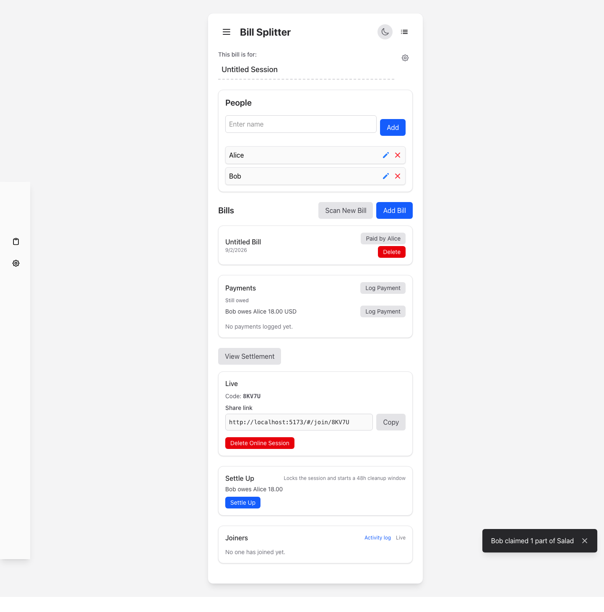
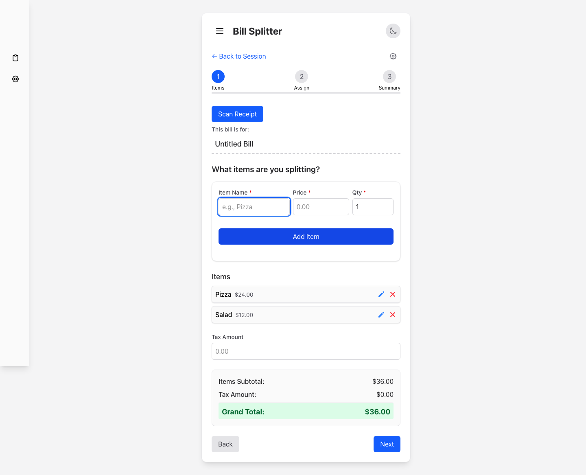
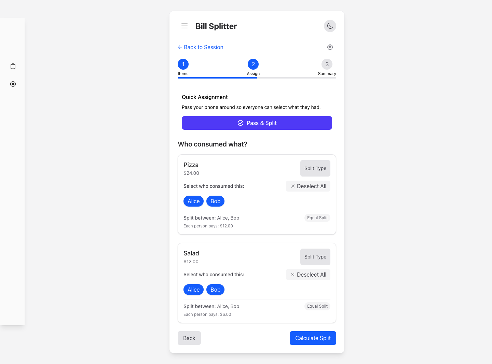
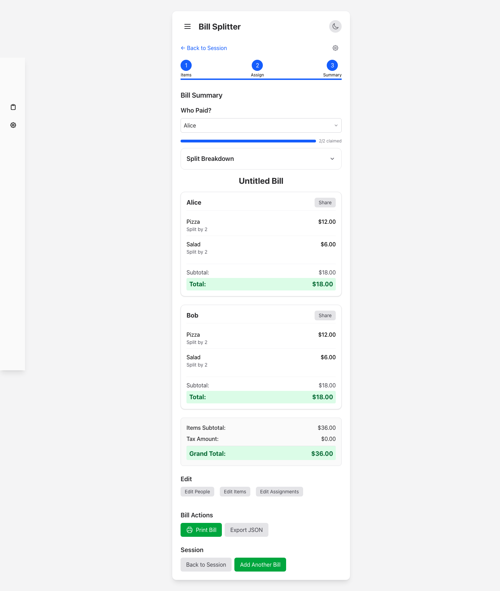

# Bill Splitter

Bill Splitter is a React + TypeScript app that simplifies splitting bills
among a group of people. It manages multiple sessions (each with its own
people and bills), guides you through a step-by-step wizard for entering
items, assigning who consumed what, and calculating totals including tax —
and, optionally, lets everyone join the same bill live from their own phone.

**Live Demo**: [https://satyajeetnigade.in/BillSplitter/](https://satyajeetnigade.in/BillSplitter/)

## Features

- **Sessions & Bills**: Organize multiple bills (e.g. per trip or event) into sessions, each with its own people; a dashboard shows all bills, who's paid, and scan status
- **3-Step Bill Wizard**: Items → Assign → Summary (people are managed on the session home page), with quick "paid by" and item edits along the way
- **Pass and Split**: Full-screen "pass the phone around the table" mode — each person swipes through items to claim what they had, instead of one person assigning everything
- **Receipt Scanning**: Upload/capture a receipt photo to auto-extract items, prices, and tax via a vision LLM (Google Gemini), including item-level discounts; scanning runs in the background so you're never blocked
- **Go Live (Multi-Device Collaboration)**: Turn any session into a shareable link/code — others join from their own device, claim items in real time (SSE-powered), and see a shared settlement; includes join approval, presence, and a per-session activity log
- **Settlement**: Automatic who-owes-who calculation with debt simplification
- **Settings**: Currency selection (with locale auto-detection) and an "auto-add-self" preference, surfaced via a one-time onboarding modal on first use
- **JSON Import/Export**: Import previously exported sessions
- **PWA / Offline-First**: Installable, works fully offline with no backend required for local use; update prompt when a new version is available
- **Dark Mode Support**: Toggle between light and dark themes
- **Local Persistence**: Bill data saved in your browser (localStorage + IndexedDB for receipt images)
- **Print Support**: Print-friendly output for sharing results
- **Mobile Responsive**: Works on devices of all sizes

## Screenshots

### Session Home: People & Bills




### Step 1: Enter Items




### Step 2: Assign Items



### Step 3: Bill Summary



## Technology Stack

- **Frontend**: React 19 + TypeScript, Vite 6, react-router-dom 7 (`HashRouter`)
- **State Management**: Zustand (`sessionStore` — persisted source of truth; `billStore` — scratch editor for the currently-open bill)
- **Validation**: Zod schemas for all persisted/wire data
- **Styling**: Tailwind CSS 4, with PWA support (`vite-plugin-pwa`)
- **Local Storage**: localStorage (session/bill data) + IndexedDB via `idb` (receipt images)
- **Live Collaboration Backend** (optional): Go server (`server/`) with SQLite (`modernc.org/sqlite`, no CGO), Server-Sent Events for real-time sync
- **Build Tool**: Vite
- **Deployment**: GitHub Pages (frontend), Docker/systemd (Go server) — see [`server/DEPLOYMENT.md`](server/DEPLOYMENT.md)

## Getting Started

### Prerequisites

- Node.js (version 18 or above)
- npm or yarn

### Installation

1. Clone the repository:
   ```bash
   git clone https://github.com/satlavida/BillSplitter.git
   cd BillSplitter
   ```

2. Install dependencies:
   ```bash
   npm install
   ```

3. Start the development server:
   ```bash
   npm run dev
   ```

4. Open your browser and navigate to:
   ```
   http://localhost:5173
   ```
   (or `npm run dev:open`, which opens `http://localhost:8000/BillSplitter/` automatically)

The app works fully offline as a static site — no backend required for
local use. The Go server is only needed for "Go Live" and "Scan Receipt";
see [Live Collaboration](#live-collaboration-optional) below.

## Usage Guide

### Sessions
1. Create a session (a group of people and their bills, e.g. a trip or event)
2. Add the people splitting bills within that session
3. Add one or more bills to the session; the session dashboard shows each bill's status, who paid, and scan status

### Bill Wizard (per bill)
1. **People** — confirm/add who's splitting this specific bill
2. **Items** — enter item details (name, price, quantity), or scan a receipt using the "Scan Receipt" button (runs in the background; supports item-level discounts); add tax if applicable
3. **Assign** — select who consumed each item (use "Select All" to assign to everyone), or use "Pass and Split" to hand the phone around and have each person swipe through and claim their own items
4. **Summary** — review what each person owes, print for sharing, or edit any step

### Go Live (optional)
From a session, click "Go Live" to get a shareable code/link. Others can
join from their own device, claim items in real time, and see a shared,
automatically-updating settlement — see
[Live Collaboration](#live-collaboration-optional) below.

## Live Collaboration (optional)

BillSplitter works fully offline with no backend at all — the sections
above cover that. There's also an optional Go server (`server/`) behind the
"Go Live" button on a session, which lets other people join with a code or
link, claim items in real time, and see a shared settlement, backed by
SQLite:

```bash
cd server
go run ./cmd/server
```

The frontend's live features (`Go Live`, `/join/:code`) talk to
`http://localhost:8080` by default; no other setup is needed for local
development. See [`server/DEPLOYMENT.md`](server/DEPLOYMENT.md) for running
it for real users (systemd, Docker, reverse proxy/TLS, environment
variables). See [`V3_PROGRESS.md`](V3_PROGRESS.md) for the full feature
list and what's still in progress.

## Deployment

**Frontend (GitHub Pages)**:

```bash
chmod +x deploy.sh  # Make the deploy script executable (first time only)
./deploy.sh
```

This script creates a GitHub Pages branch, builds the project, and pushes the changes.

Other deploy targets:
- `npm run deploy:beta` — builds and deploys to Cloudflare Pages (`billsplitter-beta`) via Wrangler, for testing changes before a GitHub Pages release
- `npm run deploy:server` — deploys the Go server (`scripts/deploy-server.sh`)

**Go server**: see [`server/DEPLOYMENT.md`](server/DEPLOYMENT.md) (systemd, Docker, reverse proxy/TLS, environment variables).

## Testing

- `npm test` — Jest unit tests (frontend)
- `npm run e2e` — Playwright end-to-end tests (boots both the Vite dev server and the real Go backend)
- `cd server && go test ./...` — Go backend tests

## Future Enhancements

- Export bills in CSV format
- Calculate individual tips
- Custom split ratios for items
- Bill history for tracking past expenses

## Contributing

Contributions are welcome! Please feel free to submit a Pull Request.

1. Fork the repository
2. Create your feature branch (`git checkout -b feature/amazing-feature`)
3. Commit your changes (`git commit -m 'Add some amazing feature'`)
4. Run tests relevant to your change (see [Testing](#testing))
5. Push to the branch (`git push origin feature/amazing-feature`)
6. Open a Pull Request

See [`CLAUDE.md`](CLAUDE.md) for the full technical overview, and
[`architecture/`](architecture/) for per-feature docs (frontend + backend
files, behavior, and notes) — read the relevant doc before changing a
feature, and update it as part of the same change.

## License

This project is licensed under the MIT License - see the LICENSE file for details. The MIT License is a permissive license that allows anyone to use, modify, and distribute your code for both personal and commercial purposes, as long as they include the original license and copyright notice.

## Acknowledgments

- Built with React, TypeScript, Zustand, and Tailwind CSS; live collaboration backend in Go
- Receipt scanning powered by Google Gemini API
- Icons from Heroicons
